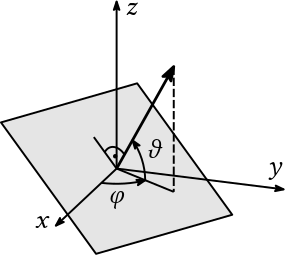
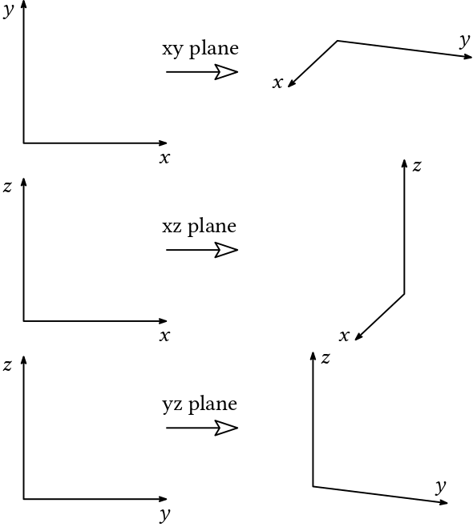
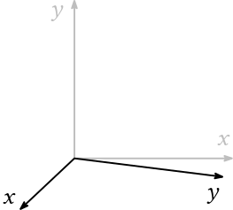

# Ipe projections

Ipelets for simple 3D drawings

## Axonometric projection

Axonometric projection can be very handy when you are creating a simple drawing in 3D, especialy in physics, math or engineering. This ipelet will hopefully makes your drawings easier to draw in less time.

Projection plane is defined by two angles $\varphi$, $\vartheta$ defining the normal vector of the plane:

### Usage

Ipelets → Axonometric projection → choose what you need. Options works as follows:

Use "revert" options to do inverse transformation.

It is a good idea to place axis system (press F1) in the origin if you want to have drawing already in place without further translation:

## Isometric projection

This ipelets works in analogy to the Axonometric projection ipelet, only the angles are already preset.

# Changes

**21 January 2023** First version uploaded
