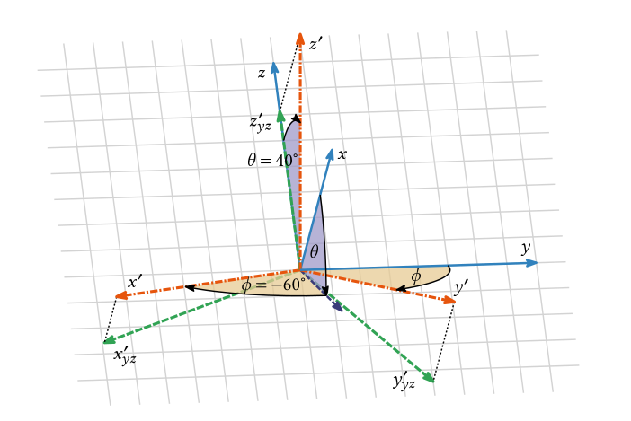
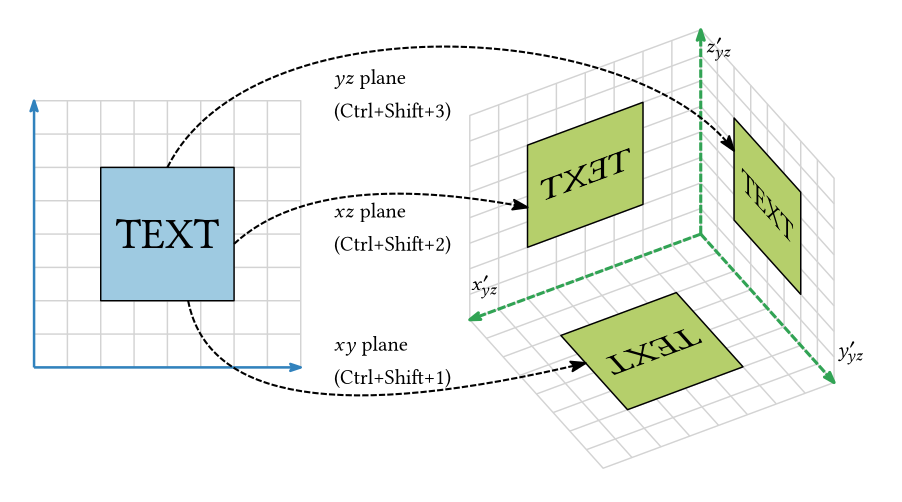

# Axonometric projections

Ipelet for simple 3D drawings.

## About

Axonometric projection can be very handy when you are creating a simple drawing in 3D, especialy in physics, math or engineering. This ipelet will hopefully make your drawings easier to draw in less time.

Projection plane is defined by two angles $\phi$, $\theta$ defining the normal vector of the plane:

### Installation

Paste the `axonometric_projections_v1.0.lua` file inside the `ipelets` folder in your Ipe installation folder.

### Using the ipelet

Navigate to `Ipelets` → `Axonometric projections`

Extra rotation before projection is possible, see the PDF manual for more information.

Use "Inverse operation" (Ctrl+Shift+Z) to do the inverse transformation.

It is a good idea to place axis system (press F1) in the origin if you want to have drawing already in place without further translation.

# Changelog

- **2023-01-21**
    - First version uploaded
- **2024-07-12**
    - Rotation before projection available for Isometric projection (Pull request by alexcg-5)
- **2024-08-24** [v1.0]
    - Big rework of the ipelet
    - Isometric projection is no longer a separate ipelet
    - Angles for projection are now stored (ultil the Ipe is closed)
    - New dialog windows for user input
    - PDF manual created
